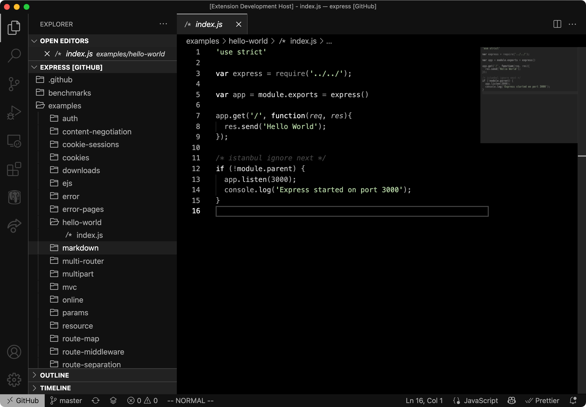

# Zero
> For when it is about the code, and only the code

A black and white vscode theme, to remove all possible distractions.

# Screenshot

# Install

Zero is available on the Visual Studio Code marketplace, and can be easily installed.

- Open extension menu
- Search for __"Zero Theme"__
- Install
- Do not forget to activate

I would strongly advise you to also install the [Chalice](https://marketplace.visualstudio.com/items?itemName=artlaman.chalice-icon-theme) icon theme, that fits really well with Zero.

# Issues

Feel free to create any issue or Pull request directly on the [github repository](https://github.com/Valkyrihane/zero).
